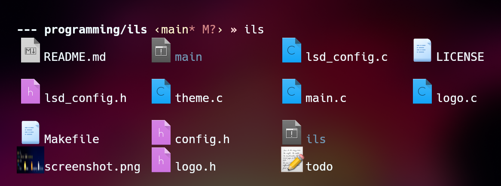

# ils: `ls` Command with Graphical Icons


## Features
- Support for freedesktop.org themes 
- Custom Icons
- Thumbnail Previews for Images

## Installation
You need a terminal emulator with the Kitty graphics protocol implemented. This includes [Kitty](https://sw.kovidgoyal.net/kitty/), [Ghostty](https://ghostty.org/), and [Konsole](https://invent.kde.org/utilities/konsole/-/merge_requests/594).

There is also this fork of [st](https://github.com/sergei-grechanik/st-graphics) <3

Support for Sixel is in development.

Clone this repository:
```bash
git clone https://github.com/Illyarb/ils
cd ils
make install

```

## Configuration

ils looks for an [lsd](https://github.com/lsd-rs/lsd) configuration file at `~/.config/lsd/icons.yaml`. You can specify your own icons there. If none is found, it will use the specified theme in the config.h file.

